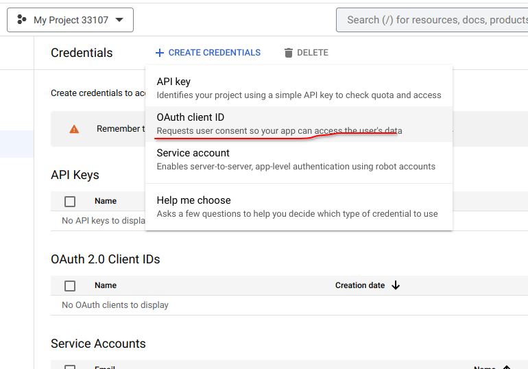

Goto [Google Cloud Console](https://console.cloud.google.com/) and click on the upper left side down arrow to open the project selection window.
Click on New Project

Give any title to the project and hit create, Now switch to the project you just created using the same project selection window.
Click on the navigation menu on the upper leftmost side

**    FIRST, you must enable the Gmail API from the Enabled APIs & services**

    Click on create credentials and click on OAuth client ID then click on configure consent screen

        Select External in User Type and hit create, Fill out the details as you want to and click next
         Make sure you add yourself and the accounts you need in the test users
        In the Scopes section click on Add or Remove Scopes and search for `gmail.modify` and click on update
        
        After the consent screen is set go back to creating OAuth client ID as stated before, Select the application type as Desktop app
        Hit create. You will have an option to download the client secret json file. Save it in the project directory by creating a directory internal
        
        Now run the generate.py script to generate the API token. 
        
        You are all set up to use the app now, Cheers :)