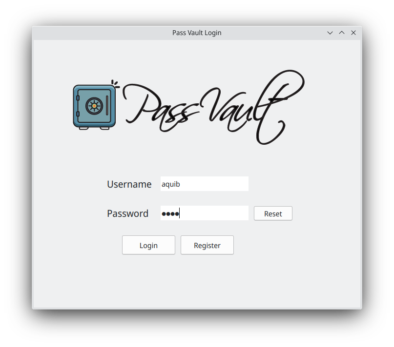
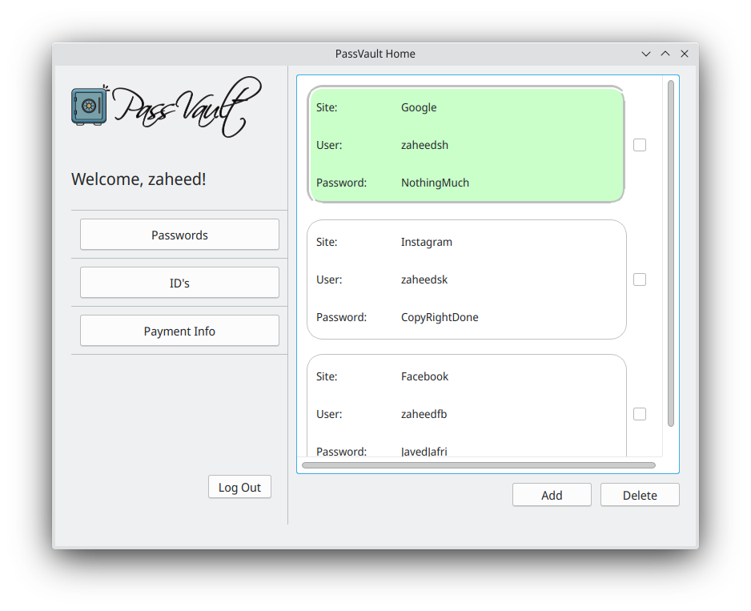
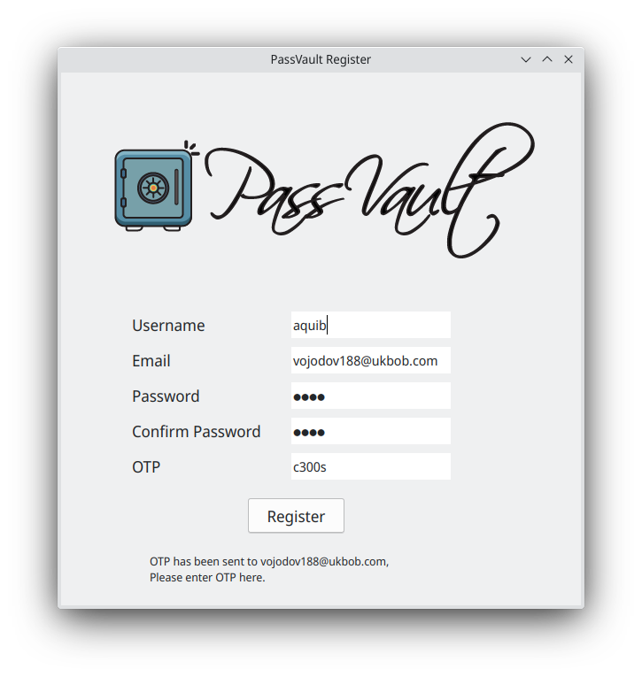

# Password Manager

A tool for storing passwords offline 

## Features:
- Stores encrypted passwords
- Secure multiuser support


    


## Usage:
This app hasn't been officially registered with Google yet so you will need to add your own project secrets.json and tokens.
Please follow [this guide](GoogleConsoleGuide.md) in order to do so

Install the dependencies using
```bash
pip3 install -r requirements.txt
```

    